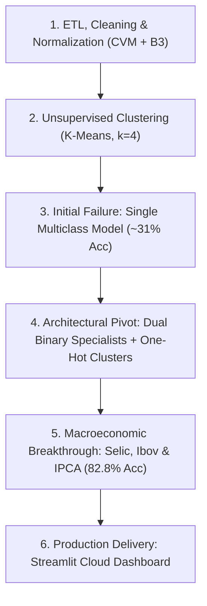

<p align="right">
  <a href="./README.md">🇧🇷 Versão em Português</a> &nbsp;|&nbsp; <b>🇺🇸 English Version</b>
</p>

<p align="center">
  
</p>

# 📊 B3 Analytics & Machine Learning (2021–2025)

[](https://ghmendes.streamlit.app)


> **End-to-End Financial Data Science & Machine Learning Case Study:** From regulatory CVM accounting statement ingestion and market data enrichment via Yahoo Finance, through unsupervised economic clustering (K-Means), dual-stage supervised predictive modeling augmented by macroeconomic covariates (Random Forest), to cloud deployment on an interactive Streamlit web dashboard.

---

## 🚀 Live Interactive Web Dashboard (Streamlit Cloud)

The entire analytical and predictive pipeline is deployed and publicly accessible in the cloud:

👉 **[Launch Live Web Dashboard](https://ghmendes.streamlit.app)**

* **📈 Fundamentalist Radiography & Price Action:** Interactive dual-axis charts comparing annual stock price trends against Return on Equity (ROE) from 2021 to 2025, alongside core accounting fundamentals (Net Income, Shareholders' Equity).
* **🎯 Economic Clustering (K-Means):** Dynamic scatter plot projecting all 51 B3-listed companies across 4 discovered economic clusters, with the active user selection highlighted with a red star marker.
* **🤖 Real-Time AI Scenario Simulator:** Interactive simulator enabling users to manually stress-test macroeconomic conditions (Selic benchmark rate, Ibovespa index, USD/BRL exchange rate, IPCA inflation) or trigger the **"Fetch Live Market Telemetry"** action via Yahoo Finance API to calculate real-time probabilistic forecasts for both stock price and ROE expansion over the subsequent 12-month horizon.

### Local Reproduction:
```bash
git clone https://github.com/StylishGH/Empresas-B3-analise-de-dados.git
cd Empresas-B3-analise-de-dados
pip install -r requirements.txt
python -m streamlit run app.py
```

---

## 💡 Domain Primer (Concepts & Methodology)

### 1. Financial Market Fundamentals
* **B3 & CVM:** **B3** (*Brasil, Bolsa, Balcão*) is the Brazilian stock exchange. The **CVM** (*Comissão de Valores Mobiliários*) is Brazil's federal securities regulator, requiring publicly traded corporations to submit standardized financial statements (DFP/ITR).
* **Net Income vs. Shareholders' Equity:**
  * *Net Income:* The bottom-line net profit retained after operating expenses, taxes, depreciation, and financial debt obligations.
  * *Shareholders' Equity:* The net book value attributable to equity holders (total corporate assets minus total liabilities).
* **Return on Equity (ROE):**
  * Core capital efficiency metric: $\text{ROE} = \frac{\text{Net Income}}{\text{Shareholders' Equity}}$. It measures how effectively executive management reinvests capital to generate surplus earnings.
* **The Selic Benchmark Rate & Market Liquidity:**
  * Brazil's **Selic** is the federal funds rate set by the Central Bank (Copom). Elevated interest rates (e.g., 13.75% annualized) increase risk-free yields on sovereign debt, drawing institutional capital out of equities into fixed income and raising corporate borrowing costs. Monetary easing cycles, conversely, expand corporate margins and drive broad equity multiple expansion.

### 2. Machine Learning & Quantitative Modeling
* **K-Means Clustering:**
  * Unsupervised vector quantization algorithm grouping high-dimensional corporate performance profiles into distinct clusters by minimizing within-cluster variance (inertia).
* **Random Forest Classifier:**
  * Supervised ensemble learning method combining de-correlated decision trees trained via bootstrap aggregation (bagging) and random feature subspace sampling, delivering strong resistance to overfitting on small tabular datasets.
* **The 4-Quadrant Strategic Decision Matrix:**
  * 🟢 **Expanding:** Simultaneous fundamental improvement ($\text{ROE} \uparrow$) and equity appreciation ($\text{Price} \uparrow$) — optimal operational regime.
  * 🔵 **Opportunity / Value Discount:** Improving underlying fundamentals ($\text{ROE} \uparrow$) amidst temporary market equity contraction ($\text{Price} \downarrow$) — potential mispricing.
  * 🟡 **Speculative / Multiple Expansion:** Stock price momentum ($\text{Price} \uparrow$) despite deteriorating capital efficiency ($\text{ROE} \downarrow$) — elevated valuation risk.
  * 🔴 **Contracting:** Deteriorating operational earnings ($\text{ROE} \downarrow$) coupled with market equity decline ($\text{Price} \downarrow$) — risk aversion regime.

---

## 📖 Engineering Log & Project Retrospective

Data engineering and machine learning workflows are rarely linear. This project encountered data anomalies, distribution shifts, and architectural trade-offs that required iterative pivots.



---

### 🧱 Stage 1: Data Ingestion, Sani-ETL & Feature Engineering
#### 🎯 Implementation:
* Ingested and structured annual standard financial statements (DFP) published by the CVM alongside daily market trading data for 51 major B3 companies from 2021 to 2025 via `yfinance`.
* Synthesized key accounting ratios ($\text{ROE} = \frac{\text{Net Income}}{\text{Equity}}$) and annual dividend-adjusted capital returns to align corporate balance sheets with equity market pricing.

#### 💥 Production Challenges & Mitigations:
* **The Unit Currency Scale Anomaly (Vivara & Metisa):**
  * *Phenomenon:* Preliminary exploratory visualizations showed Vivara (`VIVA3`) and Metisa (`MTSA4`) dominating earnings rankings with an absurd R$ 921 billion profit (surpassing Petrobras and Vale combined).
  * *Root Cause:* While 98% of Brazilian corporations report CVM filings in thousands of BRL (`ESCALA_MOEDA == 'MIL'`), selected entities report in single units (`ESCALA_MOEDA == 'UNIDADE'`).
  * *Remediation:* Built an automated scale-normalization pipeline conditioning transformations on the regulatory currency scale metadata tag, scaling unit filings down by $10^3$.
* **The Notebook Idempotency Trap:**
  * *Phenomenon:* In-place cell re-execution (`df['LUCRO'] = df['LUCRO'] / 1000`) caused multi-billion-dollar corporate earnings to degrade into fractions of a cent upon iterative runs.
  * *Remediation:* Enforced mathematical idempotency across all ETL transforms by leveraging deterministic conditional guards (`& (df['LUCRO_LIQUIDO_BI'] > 10)`), ensuring execution repeatability regardless of runtime sequence.
* **The Negative ROE Mathematical Paradox (Americanas SA, 2022):**
  * *Mathematical Edge Case:* In 2022, following accounting inconsistencies, Americanas reported multi-billion net losses alongside deeply negative net equity. Dividing two negative values yielded a falsely stellar **positive ROE (+50%)**.
  * *Remediation:* Implemented an explicit data-validation rule: `ROE_ENGANOSO = (LUCRO < 0) & (PL < 0)`, quarantining distorted accounting ratios from downstream statistical aggregations.
* **Volatile Accounting Account Identifiers (`CD_CONTA`):**
  * *Phenomenon:* Relying on regulatory account codes (`CD_CONTA 2.03`) failed because classifications varied across corporate sectors (mapping to "Provisions" for some issuers and "Operating Liabilities" for others).
  * *Remediation:* Refactored extraction pipelines to match canonical standard accounting labels (`DS_CONTA == 'Patrimônio Líquido Consolidado'`).
* **Dividend-Adjusted Returns vs. Raw Terminal Screen Quotes:**
  * Explored pricing divergence between raw terminal closes (e.g., Petrobras around R$ 48 in 2026) vs historical adjusted series (R$ 28.98 at 2025 year-end). Reconciled calculations by grounding returns strictly in total shareholder return (TSR) adjustments, properly factoring the R$ 200+ billion in cash dividends distributed over the holding horizon.

---

### 🎯 Stage 2: Unsupervised K-Means Clustering (Notebook 07)
#### 🎯 Methodology:
* Applied `StandardScaler` feature normalization and `K-Means` clustering to group companies based on multidimensional operational performance rather than arbitrary legacy sector definitions.
* Validated optimal hyperparameter selection via the **Elbow Method (Inertia minimization)** and **Silhouette Coefficient Analysis**, establishing $k = 4$ as the optimal topological cluster partition.

#### 💡 Methodological Shift:
* *Initial Approach:* Clustering cross-sectional annual snapshots independently resulted in high cluster switching noise, where identical corporations leaped between clusters annually.
* *Production Solution:* Calculated multi-year corporate performance centroid embeddings via `df_empresa.groupby('TICKER')`, extracting 4 consistent corporate regimes:
  * **Cluster 0 (Solid Blue Chips / Financial Institutions):** Predictable recurring cash generation, median ROE ~27%, average equity appreciation +23% annualized (e.g., Banco do Brasil, Bradesco, Santander, Vivara).
  * **Cluster 1 (Macro Commodities Titans):** Petrobras and Vale — capital expenditure and earnings on an order of magnitude exceeding all peers (tens of billions in net earnings).
  * **Cluster 2 (High Capital Efficiency Champions):** Superior compounding capabilities (WEG, Ambev, Sabesp) exhibiting median ROE ~79% and annual equity return of +17%.
  * **Cluster 3 (Distressed / Operational Turnarounds):** Structurally compressed margins and high leverage (Magalu, Hapvida, Cosan), averaging -19% annual returns.

---

### 🤖 Stage 3: Supervised Predictive Modeling with Machine Learning (Notebook 08)
#### 💥 Failure of the Single 4-Class Multiclass Model:
* *Hypothesis:* Directly forecast the 4 combined decision quadrants simultaneously:
  * 🟢 Expanding ($\text{ROE} \uparrow, \text{Price} \uparrow$)
  * 🔴 Contracting ($\text{ROE} \downarrow, \text{Price} \downarrow$)
  * 🔵 Opportunity ($\text{ROE} \uparrow, \text{Price} \downarrow$)
  * 🟡 Speculative ($\text{ROE} \downarrow, \text{Price} \uparrow$)
* *Outcome:* Test accuracy collapsed to **~31.03%** (marginal improvement over the 25% random baseline). With a clean sample of ~116 corporate annual cycles, distributing sparse data across 4 interdependent multiclass boundaries induced excessive variance.

#### 🧠 The Deep Learning Anti-Pattern on Small Tabular Data:
* Evaluated training a multi-layer perceptron (MLP). However, on small-sample tabular regimes ($N \approx 116$), deep neural networks are mathematically prone to catastrophic empirical risk minimization overfitting (near-zero training loss with poor out-of-sample generalization). Bagged ensemble trees (**Random Forest**) offer far superior inductive bias and variance reduction.

#### 🚀 The Architectural Solution: Dual Binary Specialists + One-Hot Clustering:
* **Decomposed the joint distribution into two specialized estimators:**
  * **Model 1 (Fundamentals Estimator):** Predicts fundamental expansion $\rightarrow P(\text{ROE}_{t+1} > \text{ROE}_t) \in \{0, 1\}$.
  * **Model 2 (Market Pricing Estimator):** Predicts market appreciation $\rightarrow P(\text{Price}_{t+1} > \text{Price}_t) \in \{0, 1\}$.
  * Recombined estimator outputs via deterministic business logic to reconstruct the 4 strategic quadrants.
* **Unsupervised-to-Supervised Feature Ingestion:** Encoded the K-Means cluster assignments as one-hot dummy variables (`CLUSTER_0.0`, `CLUSTER_1.0`, etc.), conditioning decision tree splits on structural corporate taxonomy.

#### 🔥 The Macroeconomic Breakthrough (Accuracy Surge: 51.7% $\rightarrow$ 82.8%):
* *The Bottleneck:* Even with specialized models, stock price prediction remained stagnant at **51.72%** (equivalent to a coin toss).
* *The Insight:* Equity models were micro-blind. Between 2021 and 2023, Brazil underwent an aggressive monetary tightening cycle (**Selic surged from 2.00% to 13.75% per annum**). In a 14% risk-free rate environment, institutional liquidity drained from equities regardless of individual balance sheet health. Highly profitable corporations suffered valuation multiple compression due purely to systemic monetary policy.
* *The Solution:* Engineered macroeconomic covariate features: annual Selic rate (`SELIC_ANO_%`), year-over-year rate delta (`VAR_SELIC_PP`), benchmark inflation (`IPCA_ANO_%`), broad market return (`IBOV_RETORNO_%`), and currency variance (`DOLAR_VAR_%`).
* *Out-of-Sample Test Results:*
  * **Stock Price Appreciation Model (`ACAO_SOBE`):** Surged from 51.72% to **82.76%** (**+31.04 percentage points**).
  * **Fundamental ROE Expansion Model (`ROE_SOBE`):** Improved from 51.72% to **62.07%**.
  * **Combined 4-Quadrant Scenario Accuracy:** Jumped from 31.03% to **55.17%** (over 2.2x better than random selection).

---

### 🖥️ Stage 4: Cloud Production Deployment (`app.py` via Streamlit)
#### 🎯 Deliverables:
* Full interactive production dashboard deployed on Streamlit Cloud:
  * **Exploratory & Fundamental Analytics:** Plotly dual-axis tracking of equity price and ROE trajectories, gross/net margins, and corporate balance sheet evolution.
  * **Cluster Cartography:** Interactive scatter visualization with dynamic hover telemetry, sector filters, and active company highlight flags.
  * **Real-Time Live Macroeconomic Inference Engine:** Alongside manual parameter sliders, integrated an automated hook to the Yahoo Finance API to ingest real-time rates (USD/BRL, Selic proxy, Ibovespa index, and annualized IPCA), generating instantaneous probabilistic forecasts reflecting current market conditions.

---

### 🏆 Key Production Takeaways

1. **Decouple Complex Targets:** On small, noisy tabular datasets, decomposing an entangled multiclass problem into specialized binary classification models consistently outperforms monolithic architectures.
2. **Occam's Razor in Machine Learning:** Well-regularized ensemble trees (Random Forest) combined with rigorous feature engineering beat deep neural networks on tabular datasets by avoiding catastrophic parameter overfitting.
3. **End-to-End Pipeline Synergy:** Unsupervised topological representations (K-Means) can serve as feature inputs for downstream supervised predictive learners.
4. **Micro Is Blind Without Macro:** Corporate balance sheet analysis in emerging markets is incomplete without macroeconomic indicators. Integrating monetary policy signals (Selic) and market liquidity shifted model performance from random guessing (51%) to actionable predictive utility (83%).

---

## 📌 Repository Notebook Structure

| Notebook | Scope & Purpose | Core Methodologies |
| :--- | :--- | :--- |
| **01 to 05** | CVM regulatory ingestion (DRE / BPP), cleansing, SQL staging | Pandas, SQLite, schema normalization, accounting rule enforcement |
| **06** | Market data integration & corporate action adjustment | `yfinance`, B3 price series ingestion, scale anomaly fixes (Vivara/Metisa) |
| **07** | Unsupervised economic clustering | `K-Means`, `StandardScaler`, Elbow Method, Silhouette Analysis ($k=4$) |
| **08** | Predictive supervised modeling | `RandomForestClassifier`, Macroeconomic Feature Engineering (Selic, Ibov, IPCA, USD/BRL) |
| **app.py** | Cloud Web Production Application | `Streamlit`, `Plotly`, `yfinance`, `@st.cache_data`, `@st.cache_resource` |

---

## 🛠️ Technology Stack

* **Programming Language:** Python 3.14
* **Data Processing & Analytics:** Pandas, NumPy, SQLite
* **Visualization & Dashboarding:** Streamlit Cloud, Plotly Express & Graph Objects, Matplotlib, Seaborn
* **Machine Learning & Modeling:** Scikit-Learn (Pipelines, StandardScaler, KMeans, RandomForestClassifier, Metrics)
* **Financial Data APIs:** Yahoo Finance (`yfinance`), Brazilian Securities Commission (CVM Open Data)

---

## 👤 Author

<p align="left">
  
  <b>Developed by Guilherme Henrique Mendes</b> (<a href="https://github.com/StylishGH">@StylishGH</a>)
</p>

Mathematics undergraduate at Universidade Federal Fluminense (UFF)  
Aspiring Data Scientist & Machine Learning Engineer  
🔗 [GitHub](https://github.com/StylishGH) · 🔗 [LinkedIn](https://www.linkedin.com/in/ghmendes/)
