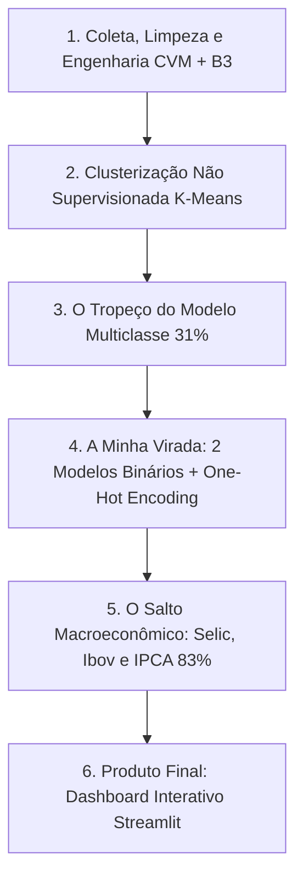

# 📊 B3 Analytics & Machine Learning (2021-2025)

[](https://ghmendes.streamlit.app)


> **Meu case completo de Ciência de Dados Financeiros:** Da coleta e saneamento de balanços da CVM ao cruzamento com cotações históricas da B3 (Yahoo Finance), agrupamento não supervisionado (K-Means), modelagem preditiva supervisionada com contexto macroeconômico (Random Forest) e deploy em um dashboard web interativo no Streamlit.

---

## 🚀 Meu Dashboard Interativo no Ar (Streamlit)

Eu transformei todo o pipeline deste projeto em uma aplicação web interativa e publiquei na nuvem:

👉 **[Acesse o Dashboard Online aqui!](https://ghmendes.streamlit.app)**

* **📈 Raio-X Fundamentalista & Cotações:** Criei cards com os indicadores mais recentes (ROE, Lucro Líquido, PL) e um gráfico de duplo eixo comparando a evolução do preço da ação com o ROE de 2021 a 2025.
* **🎯 Agrupamento Econômico (K-Means):** Plotei um mapa de dispersão com todas as empresas da B3 classificadas nos 4 clusters que encontrei, destacando a empresa que o usuário selecionou com uma estrela vermelha.
* **🤖 Simulador Preditivo com IA:** Desenvolvi um simulador onde você pode mexer nos sliders macroeconômicos (Selic, Ibovespa, Dólar, Inflação) ou clicar no botão de **"Puxar Métricas Reais do Mercado Agora"** (via API do Yahoo Finance) para ver a minha Inteligência Artificial calcular na hora a probabilidade de alta da ação e do ROE no próximo ano.

### Como rodar o meu projeto localmente:
```bash
git clone https://github.com/StylishGH/Empresas-B3-analise-de-dados.git
cd Empresas-B3-analise-de-dados
pip install -r requirements.txt
python -m streamlit run app.py
```

---

## 📖 Meu Diário de Bordo & Retrospectiva do Projeto

Desenvolver este projeto não foi uma linha reta. Tive ideias que deram errado, cometi erros de iniciante, me deparei com bizarrices nos dados públicos e precisei pivotar várias vezes até chegar na solução ideal. Aqui está o resumo dessa jornada:



---

### 🧱 Etapa 1: Coleta, Limpeza e Engenharia de Dados
#### 🎯 O que eu fiz:
* Coletei e consolidei os balanços contábeis públicos da CVM (DFP) e as cotações de 51 empresas da B3 de 2021 a 2025 via `yfinance`.
* Calculei o ROE ($\frac{\text{Lucro Líquido}}{\text{Patrimônio Líquido}}$) e o Retorno Anual das Ações para cruzar a saúde contábil com a precificação de mercado.

#### 💥 Os tropeços que dei & o que aprendi:
* **O Bug da Escala Invisível (Metisa e Vivara):**
  * *O que aconteceu:* Quando montei os primeiros gráficos, a Metisa (`MTSA4`) e a Vivara (`VIVA3`) pareciam estar com lucro e patrimônio quase zerados perto das outras.
  * *O motivo da besteira:* Praticamente todas as empresas na CVM reportam seus valores em milhares de reais (`ESCALA_MOEDA == 'MIL'`), mas a Vivara e a Metisa reportaram em **unidades** (`ESCALA_MOEDA == 'UNIDADE'`)! Sem tratar isso, a Vivara aparecia no meu ranking com **R$ 921 bilhões de lucro** (mais que Petrobras e Vale juntas).
  * *Como resolvi:* Criei uma normalização específica para empresas com moeda em unidade, dividindo seus valores por 1.000 para equipará-las às demais.
* **O Bug da "Divisão Infinita" no Jupyter (Falta de Idempotência):**
  * *O que aconteceu:* Em uma célula do meu notebook, escrevi: `df['LUCRO'] = df['LUCRO'] / 1000`.
  * *O susto:* Cada vez que eu reexecutava a célula para testar algo novo, ela dividia os números por mais 1.000. No terceiro clique, os lucros de bilhões viraram centavos!
  * *Como resolvi:* Aprendi na prática o conceito de **idempotência**. Passei a usar travas condicionais (`& (df['LUCRO_LIQUIDO_BI'] > 10)`), garantindo que a divisão só aconteça se o dado ainda estiver fora da escala correta.
* **O Paradoxo do ROE da Americanas em 2022 (Menos com Menos dá Mais):**
  * *A pegadinha matemática:* O ROE divide Lucro por Patrimônio Líquido. Quando a Americanas teve um prejuízo bilionário e seu patrimônio ficou negativo, a divisão de dois números negativos resultou em um **ROE positivo de +50%**!
  * *Como resolvi:* Criei uma flag booleana `ROE_ENGANOSO = (LUCRO < 0) & (PL < 0)` para sinalizar e filtrar essas anomalias para não poluir meus rankings.
* **O Código de Conta que me Enganou (`CD_CONTA 2.03`):**
  * O código de conta do Patrimônio Líquido não era estável (o código `2.03` era "Provisões" em uma empresa e "Passivos" em outra). Tive que abandonar o filtro por código e filtrar pela descrição exata (`DS_CONTA == 'Patrimônio Líquido Consolidado'`).
* **O Susto que Tomei com o Ano de 2025 (Achei que era Bug Meu):**
  * *O que aconteceu:* No final da base, vi prejuízos gigantescos (Usiminas com -R$ 5.8 Bi, CSN com -R$ 6.0 Bi, Hapvida, Auren). Na hora achei que tinha quebrado o código.
  * *O que aprendi:* Não era bug! Eram os prejuízos reais reportados pelos setores siderúrgico e elétrico em 2024/2025. Dados financeiros reais têm quedas bruscas.
* **Cotação Ajustada vs Preço de Tela no Google:**
  * Quando olhei a Petrobras no meu dashboard a R$ 28,98 (fechamento 2025) e vi R$ 48,50 no Google em 2026, achei estranho. Aí lembrei que na análise quantitativa profissional usamos a **cotação ajustada por proventos** (o `yfinance` desconta os mais de R$ 200 bilhões de dividendos que a Petrobras pagou no período para refletir o retorno real do investidor).

---

### 🎯 Etapa 2: Clusterização K-Means (Notebook 07)
#### 🎯 O que eu fiz:
* Usei o algoritmo **K-Means** com `StandardScaler` para agrupar as empresas pelo comportamento financeiro real, sem depender só do setor cadastrado na CVM.
* Validei o número ótimo de grupos usando o **Método do Cotovelo (Inércia)** e o **Score da Silhueta** ($k=4$).

#### 💡 A minha virada metodológica:
* *Minha primeira tentativa:* Tentei clusterizar cada ano de cada empresa isoladamente. Foi uma bagunça: a mesma empresa mudava de cluster todo ano.
* *A minha solução:* Agrupei a média histórica por `TICKER` (`df_empresa.groupby('TICKER')`), descobrindo 4 perfis corporativos muito claros na B3:
  * **Cluster 0 (Blue Chips & Sólidas):** Lucros consistentes, ROE médio de ~27% e valorização média de +23% a.a. (ex: BB, Bradesco, Santander, Vivara).
  * **Cluster 1 (Titãs da Bolsa):** Petrobras e Vale (escala massiva de dezenas de bilhões de lucro).
  * **Cluster 2 (Campeãs de Super ROE):** Altíssima eficiência de capital (WEG, Ambev, Sabesp) com ROE médio de ~79% e retorno de +17% a.a.
  * **Cluster 3 (Em Queda / Crise):** Empresas em estresse operacional (Magalu, Hapvida, Cosan) com rentabilidade comprimida e retorno médio de -19% a.a.

---

### 🤖 Etapa 3: Modelagem Preditiva com Machine Learning (Notebook 08)
#### 💥 O tropeço que tive no Modelo Multiclasse (4 Classes):
* *Minha ideia inicial:* Tentar prever diretamente em um único modelo os 4 quadrantes combinados:
  * 🟢 Crescente (ROE Sobe, Ação Sobe)
  * 🔴 Decrescente (ROE Cai, Ação Cai)
  * 🔵 Oportunidade (ROE Sobe, Ação Cai)
  * 🟡 Especulação (ROE Cai, Ação Sobe)
* *O resultado:* A acurácia foi péssima (**~31%**). Como eu tinha ~116 linhas de dados anuais válidos, tentar prever 4 classes ao mesmo tempo gerou ruído demais para pouca amostra.

#### 🧠 A tentação do Deep Learning (E por que decidi não usar):
* Cheguei a pensar: *"Será que se eu usar uma Rede Neural com 2 neurônios na saída não resolve?"*. Mas percebi que em *Small Data Tabular* (~116 linhas), redes neurais sofrem de *overfitting* brutal (elas decoram o treino e erram tudo no teste). Árvores de decisão (**Random Forest**) são cientificamente superiores para esse tipo e volume de dado.

#### 🚀 A minha virada: 2 Modelos Especialistas + One-Hot Encoding:
* **Dividi o problema em dois:**
  * **Modelo 1 (ROE):** Focado puramente em Fundamentos $\rightarrow$ O ROE vai subir? (0 ou 1)
  * **Modelo 2 (Ação):** Focado em Mercado $\rightarrow$ A cotação vai subir? (0 ou 1)
  * E depois cruzei as respostas com lógica de negócios para formar os 4 quadrantes!
* **Usei o K-Means como Feature:** Transformei os clusters do Notebook 07 em variáveis dummy (`CLUSTER_0.0`, `CLUSTER_1.0`, etc.) usando One-Hot Encoding para alimentar o Random Forest.

#### 🔥 A maior virada de todas: O Salto Macroeconômico (De 51% para 83%):
* *O mistério:* Mesmo com os dois modelos, a acurácia para prever se a ação subiria estava travada em **51.72%** (o mesmo que jogar uma moeda).
* *A minha percepção:* Percebi que o modelo estava "cego". Entre 2021 e 2023, o Brasil viveu um choque violento de juros (**a Selic disparou de 2% para 13.75% a.a.**). Quando o juro vai a 14%, a bolsa inteira cai porque o dinheiro foge para a Renda Fixa. Uma empresa podia ter lucros crescentes, mas sua ação caía mesmo assim pela maré macroeconômica.
* *A solução:* Criei variáveis macroeconômicas (`SELIC_ANO_%`, `VAR_SELIC_PP`, `IPCA_ANO_%`, `IBOV_RETORNO_%` e `DOLAR_VAR_%`) e juntei ao treino.
* *O salto no teste:*
  * **Previsão da Ação (`ACAO_SOBE`):** Saltou de 51.72% para **82.76%** (+31 pontos percentuais!).
  * **Previsão do ROE (`ROE_SOBE`):** Subiu de 51.72% para **62.07%**!
  * **Acerto do Cenário Combinado:** Saltou de 31.03% para **55.17%** (muito acima dos 25% de um chute aleatório)!

---

### 🖥️ Etapa 4: O Produto Final (`app.py` com Streamlit)
#### 🎯 O que eu entreguei:
Construí uma aplicação web completa e interativa em Streamlit contendo:
* **Visão Geral e Indicadores:** Gráficos interativos com Plotly de Cotação e ROE com duplo eixo, Lucro e Patrimônio.
* **Módulo de Clusters:** Mapa de dispersão interativo com zoom, hover e destaque da empresa selecionada com uma estrela vermelha.
* **Simulador de Inteligência Artificial em Tempo Real:** Além dos sliders manuais, adicionei um botão que consulta a API do Yahoo Finance ao vivo para puxar o **Dólar hoje, o Ibovespa hoje, a Selic atual e o IPCA**, fazendo a IA prever o cenário da empresa com as métricas reais do mercado agora.

---

### 🏆 As 4 Lições que Levo Deste Projeto para a Minha Carreira:
1. *"Dado financeiro é barulhento: separar modelos especialistas (Fundamentos vs Preço) é muito superior a forçar um modelo multiclasse genérico."*
2. *"Modelos simples e bem ajustados (Random Forest + Feature Engineering) batem redes neurais em bases tabulares enxutas."*
3. *"A clusterização não supervisionada serviu como feature para o modelo supervisionado, fechando o ciclo completo de Ciência de Dados."*
4. *"Micro sem Macro é cego no Brasil: adicionar o ciclo de juros (Selic) e a maré da bolsa fez o meu modelo saltar de 51% para 83% de acurácia na previsão de ações."*

---

## 📌 Estrutura dos Notebooks

| Notebook | Objetivo Principal | Principais Técnicas |
| :--- | :--- | :--- |
| **01 a 05** | Extração CVM (DRE/BPP), saneamento de dados e SQL | Pandas, SQLite, tratamento de escala e regras contábeis |
| **06** | Enriquecimento de Mercado | `yfinance`, download de cotações B3, cálculo de retornos e correção de anomalia de moeda (Vivara/Metisa) |
| **07** | Agrupamento Não Supervisionado | `K-Means`, `StandardScaler`, Método do Cotovelo (Elbow) e Silhouette Score ($k=4$) |
| **08** | Modelagem Preditiva com IA | `RandomForestClassifier`, Engenharia de Features Macroeconômicas (Selic, Ibov, IPCA, Dólar) |
| **app.py** | Produto Final / Web App | `Streamlit`, `Plotly`, `yfinance`, `@st.cache_data`, `@st.cache_resource` |

---

## 🛠️ Stack Técnica
* **Linguagem:** Python 3.14
* **Manipulação de Dados:** Pandas, NumPy, SQLite
* **Visualização:** Streamlit, Plotly Express & Graph Objects, Matplotlib, Seaborn
* **Machine Learning:** Scikit-Learn (Pipelines, StandardScaler, KMeans, RandomForestClassifier)
* **Mercado Financeiro:** Yahoo Finance (`yfinance`), CVM Dados Públicos

---

## 👤 Autor
Desenvolvido por **Guilherme** ([@StylishGH](https://github.com/StylishGH)).