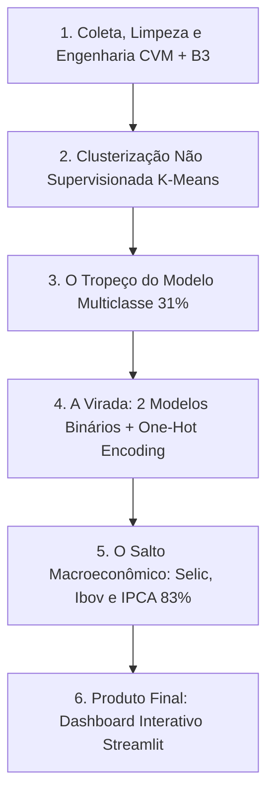

# 📊 B3 Analytics & Machine Learning (2021-2025)

[](https://share.streamlit.io)


> **Case completo de Ciência de Dados Financeiros:** Da coleta e saneamento contábil na CVM ao cruzamento com cotações da B3 (Yahoo Finance), agrupamento não supervisionado (K-Means), modelagem preditiva supervisionada com contexto macroeconômico (Random Forest) e deploy em aplicação web interativa com Streamlit.

---

## 🚀 Dashboard Interativo (Streamlit)

A aplicação web interativa reúne todo o pipeline do projeto em uma interface gráfica moderna:

* **📈 Raio-X Fundamentalista & Cotações:** Indicadores de ROE, Lucro Líquido, PL e gráfico com eixo duplo (Preço da Ação vs ROE) de 2021 a 2025.
* **🎯 Agrupamento Econômico (K-Means):** Mapa de dispersão interativo com todas as empresas da B3 classificadas em 4 clusters, destacando a empresa selecionada com uma estrela vermelha.
* **🤖 Simulador Preditivo com IA:** Simulador interativo onde o usuário ajusta as variáveis macroeconômicas (Selic, Ibovespa, Dólar, Inflação) e vê a IA estimar em tempo real a probabilidade de alta da ação e do ROE no ano seguinte.

### Como rodar localmente:
```bash
git clone https://github.com/StylishGH/Empresas-B3-analise-de-dados.git
cd Empresas-B3-analise-de-dados
pip install -r requirements.txt
python -m streamlit run app.py
```

---

## 📖 Diário de Bordo & Retrospectiva do Projeto



---

### 🧱 Etapa 1: Coleta, Limpeza e Engenharia de Dados
#### 🎯 O que foi feito:
* Consolidação de dados contábeis (CVM DFP) e cotações de 51 empresas da B3 de 2021 a 2025 via `yfinance`.
* Engenharia de variáveis financeiras: cálculo do ROE ($\frac{\text{Lucro Líquido}}{\text{Patrimônio Líquido}}$) e do Retorno Anual da Cotação.

#### 💥 Os Tropeços & Aprendizados:
* **O Bug da Escala Invisível (Metisa e Vivara):**
  * *O que aconteceu:* Nos gráficos interativos, empresas como Metisa (`MTSA4`) e Vivara (`VIVA3`) pareciam estar com lucro e patrimônio zerados ou desproporcionais.
  * *O motivo:* Quase todas as empresas da CVM reportam em milhares (`ESCALA_MOEDA == 'MIL'`), mas Vivara e Metisa reportaram em unidades (`ESCALA_MOEDA == 'UNIDADE'`)! Sem tratar, a Vivara aparecia com R$ 921 bilhões de lucro (mais que Petrobras e Vale juntas).
  * *A virada:* Normalização e padronização da escala monetária com travas lógicas.
* **O Bug da "Divisão Infinita" no Jupyter (Falta de Idempotência):**
  * *O que aconteceu:* A célula `df['LUCRO'] = df['LUCRO'] / 1000` dividia o valor novamente a cada re-execução do notebook.
  * *A virada:* Transformações idempotentes usando travas condicionais (`& (df['LUCRO_LIQUIDO_BI'] > 10)`).
* **O Paradoxo do ROE Positivo em Empresas Falidas (Americanas 2022):**
  * *A armadilha matemática:* Lucro negativo (-R$ 5 bi) dividido por patrimônio negativo (-R$ 10 bi) resulta matematicamente em um ROE positivo de +50%!
  * *A virada:* Criação da flag booleana `ROE_ENGANOSO = (LUCRO < 0) & (PL < 0)` para sinalizar e isolar distorções contábeis.
* **O Código de Conta que Engana (`CD_CONTA 2.03`):**
  * O código de conta de PL não é padronizado entre todas as empresas (o mesmo código `2.03` era "Provisões" em uma e "Passivo" em outra). O filtro correto precisou ser por descrição exata (`DS_CONTA == 'Patrimônio Líquido Consolidado'`).
* **O Susto do Ano de 2025 (Falso Bug):**
  * *O que aconteceu:* Linhas com lucros e ROEs negativos gigantes (Usiminas -R$ 5.8 Bi, CSN -R$ 6.0 Bi, Hapvida, Auren) pareceram erros de código.
  * *O aprendizado:* Não era bug! Eram os prejuízos reais reportados pelo setor siderúrgico e elétrico em 2024/2025. Dados financeiros têm quedas bruscas reais.

---

### 🎯 Etapa 2: Clusterização e Aprendizado Não Supervisionado (Notebook 07)
#### 🎯 O que foi feito:
* Aplicação do algoritmo **K-Means** com `StandardScaler` para descobrir agrupamentos naturais de empresas por comportamento financeiro.
* Validação matemática do número ideal de grupos usando o **Método do Cotovelo (Inércia)** e o **Score da Silhueta** ($k=4$).

#### 💡 A Grande Virada Metodológica:
* *Primeira tentativa:* Clusterizar cada "ano" isolado de cada empresa gerava inconsistência (a mesma empresa mudava de grupo a cada ano).
* *A solução definitiva:* Agrupar a média histórica por `TICKER` (`df_empresa.groupby('TICKER')`), criando 4 personas de mercado reais:
  * **Cluster 0:** Blue Chips & Sólidas (+23% a.a.)
  * **Cluster 1:** Titãs da Bolsa / Commodities (Petrobras, Vale)
  * **Cluster 2:** Campeãs de Super ROE (+17% a.a. - WEG, Ambev, Sabesp)
  * **Cluster 3:** Alavancadas / Em Queda / Varejo (-19% a.a. - Magalu, Hapvida, Cosan)

---

### 🤖 Etapa 3: Modelagem Preditiva e Machine Learning (Notebook 08)
#### 💥 O Tropeço do Modelo Multiclasse (4 Classes):
* *A ideia inicial:* Tentar prever diretamente em um único modelo os 4 quadrantes combinados:
  * 🟢 Crescente (ROE Sobe, Ação Sobe)
  * 🔴 Decrescente (ROE Cai, Ação Cai)
  * 🔵 Oportunidade (ROE Sobe, Ação Cai)
  * 🟡 Especulação (ROE Cai, Ação Sobe)
* *O resultado:* Acurácia baixa (**~31%**). Prever duas variáveis financeiras imprevisíveis simultaneamente em poucas amostras (~116 linhas) multiplicou o ruído estatístico.

#### 🧠 A Tentação do Deep Learning (E por que não usamos):
* Cogitou-se usar Redes Neurais Profundas, mas em *Small Data Tabular* (~116 linhas), redes neurais decoram os dados (*overfitting* brutal). Árvores de decisão (**Random Forest**) são cientificamente superiores para esse volume e tipo de dado.

#### 🚀 A Virada 1: 2 Modelos Especialistas + One-Hot Encoding:
* **Separar em 2 Modelos Binários:**
  * **Modelo 1 (ROE):** Focado puramente em Fundamentos $\rightarrow$ A rentabilidade melhora? (0 ou 1)
  * **Modelo 2 (Ação):** Focado puramente em Mercado $\rightarrow$ A cotação sobe? (0 ou 1)
* **Modularidade entre Notebooks:** Em vez de recalcular o K-Means no 08, exportou-se `clusters_empresas.csv` no Notebook 07 e fez-se o `merge` no 08.
* **One-Hot Encoding nos Clusters:** Transformação de `CLUSTER` em dummies (`CLUSTER_0.0`, `CLUSTER_1.0`, etc.) para a árvore isolar cada grupo sem impor ordem matemática falsa.

#### 🔥 A Virada 2: O Salto das Variáveis Macroeconômicas (De 51% para 83%):
* *O Diagnóstico:* Mesmo com dois modelos, prever a ação batia apenas **51.72%** (uma moeda). O motivo? O modelo estava "cego" para o macro. Entre 2021 e 2023, o Brasil viveu um choque violento de juros (**Selic de 2% para 13.75% a.a.**). Mesmo empresas com ótimos resultados caíram na bolsa devido à fuga para a Renda Fixa.
* *A Solução:* Enriquecimento com `SELIC_ANO_%`, `VAR_SELIC_PP`, `IPCA_ANO_%`, `IBOV_RETORNO_%` e `DOLAR_VAR_%`.
* *O Salto de Performance no Teste:*
  * **Acurácia da Ação (`ACAO_SOBE`):** saltou de 51.72% para **82.76%** (+31.04 p.p.)!
  * **Acurácia do ROE (`ROE_SOBE`):** subiu de 51.72% para **62.07%**!
  * **Acerto do Cenário Combinado:** saltou de 31.03% para **55.17%** (vs 25% do chute aleatório)!

---

### 🖥️ Etapa 4: O Produto Final (`app.py` com Streamlit)
#### 🎯 O que foi entregue:
Um Dashboard Interativo em Streamlit contendo:
* **📈 Visão Geral e Indicadores:** Gráficos interativos com Plotly de Cotação e ROE com duplo eixo, Lucro e Patrimônio.
* **🎯 Módulo de Clusters:** Mapa de dispersão interativo destacando a empresa selecionada com uma estrela vermelha.
* **🤖 Simulador de Inteligência Artificial:** O usuário escolhe a empresa e ajusta os sliders macroeconômicos (Selic, Ibovespa, Dólar, Inflação). Os 2 modelos Random Forest calculam as probabilidades em tempo real, entregando o diagnóstico com badges de cor, ícones e barras de progresso.

---

### 🏆 Resumo das Melhores Lições para Apresentar / Entrevistas:
1. *"Dado financeiro é barulhento: separar modelos especialistas (Fundamentos vs Preço) é muito superior a forçar um modelo multiclasse genérico."*
2. *"Modelos simples e bem ajustados (Random Forest + Feature Engineering) batem redes neurais em bases tabulares enxutas."*
3. *"A clusterização não supervisionada serviu como feature para o modelo supervisionado, fechando o ciclo completo de Ciência de Dados."*
4. *"Micro sem Macro é cego no Brasil: adicionar o ciclo de juros (Selic) e a maré da bolsa fez o modelo saltar de 51% para 83% de acurácia na previsão de ações."*

---

## 📌 Estrutura dos Notebooks

| Notebook | Objetivo Principal | Principais Técnicas |
| :--- | :--- | :--- |
| **01 a 05** | Extração CVM (DRE/BPP), saneamento de dados e SQL | Pandas, SQLite, tratamento de escala e regras contábeis |
| **06** | Enriquecimento de Mercado | `yfinance`, download de cotações B3, cálculo de retornos e correção de anomalia de moeda (Vivara/Metisa) |
| **07** | Agrupamento Não Supervisionado | `K-Means`, `StandardScaler`, Método do Cotovelo (Elbow) e Silhouette Score ($k=4$) |
| **08** | Modelagem Preditiva com IA | `RandomForestClassifier`, Engenharia de Features Macroeconômicas (Selic, Ibov, IPCA, Dólar) |
| **app.py** | Produto Final / Web App | `Streamlit`, `Plotly`, `@st.cache_data`, `@st.cache_resource` |

---

## 🛠️ Stack Técnica
* **Linguagem:** Python 3.14
* **Manipulação de Dados:** Pandas, NumPy, SQLite
* **Visualização:** Streamlit, Plotly Express & Graph Objects, Matplotlib, Seaborn
* **Machine Learning:** Scikit-Learn (Pipelines, StandardScaler, KMeans, RandomForestClassifier)
* **Mercado Financeiro:** Yahoo Finance (`yfinance`), CVM Dados Públicos

---

## 👤 Autor
Desenvolvido por **Guilherme** ([@StylishGH](https://github.com/StylishGH)).